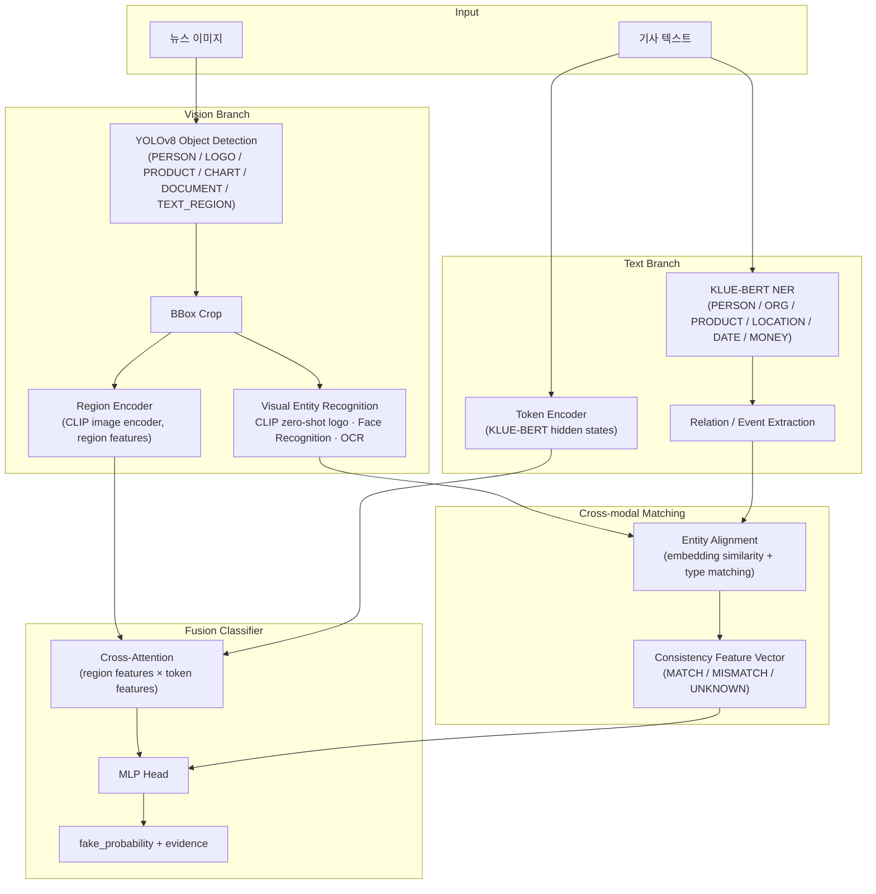
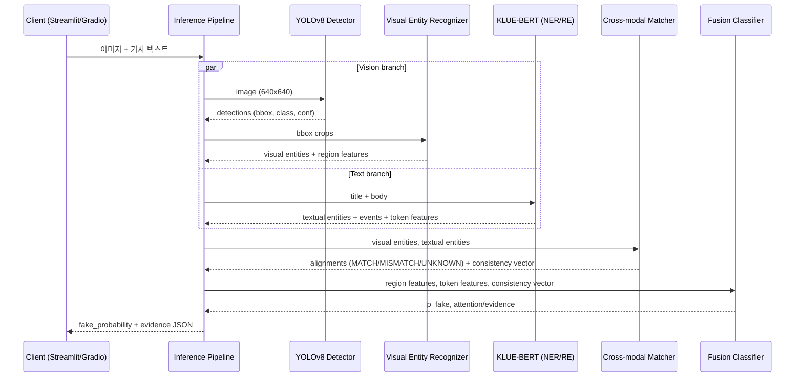

# FinFact 시스템 아키텍처

Object-Level Multimodal Financial Misinformation Detection — 이미지 속 시각적 증거(visual entity)와 기사 텍스트의 주장(textual entity)을 객체 단위로 대조하여 금융 가짜뉴스를 탐지하는 시스템의 상세 설계 문서.

---

## 1. 시스템 전체 아키텍처



핵심 설계 원칙: 이미지 전체 vs 문장 전체의 단일 CLIP similarity가 아니라, **object-level 증거(word-region pair)** 와 **entity-level 주장**을 하나씩 대조한다 (EM-FEND, CFFN, Event-Radar 계열 접근).

---

## 2. 모듈별 상세 설계

### 2.1 Vision Branch

#### 2.1.1 YOLOv8 Object Detection

커스텀 6-class fine-tuning (pretrained COCO weights에서 시작).

| Class ID | Class | 설명 | 후속 처리 |
|---|---|---|---|
| 0 | `PERSON` | 인물 (CEO, 임원 등) | Face Recognition |
| 1 | `LOGO` | 기업/브랜드 로고 | CLIP zero-shot logo classification |
| 2 | `PRODUCT` | 제품 (칩, 기기 등) | CLIP zero-shot product classification |
| 3 | `CHART` | 주가/실적 차트 | OCR (수치·날짜·축 label 추출) |
| 4 | `DOCUMENT` | 공시·계약서·문서 이미지 | OCR (전문 추출) |
| 5 | `TEXT_REGION` | 이미지 내 자막·캡션·워터마크 | OCR |

- 입력: RGB 이미지, letterbox resize `640×640`
- 출력: `List[Detection]`, `Detection = {class_id, class_name, bbox: [x1,y1,x2,y2], conf}`
- 필터: `conf ≥ 0.4`, class-agnostic NMS `IoU 0.5`, 이미지당 최대 `R = 16` regions
- 평가지표: mAP@50, Precision, Recall

#### 2.1.2 Visual Entity Recognition (bbox crop 이후)

각 detection의 bbox를 crop하여 class별 전용 recognizer로 라우팅한다.

| Detection class | Recognizer | 방법 |
|---|---|---|
| `PERSON` | Face Recognition | face embedding (예: ArcFace/InsightFace) → 인물 DB cosine similarity, threshold 0.5 |
| `LOGO`, `PRODUCT` | CLIP zero-shot | crop 임베딩 vs 프롬프트 `"a logo of {company}"` / `"a photo of {product}"` 후보군 similarity, softmax top-1 |
| `CHART`, `DOCUMENT`, `TEXT_REGION` | OCR | 딥러닝 기반 OCR (예: PaddleOCR/EasyOCR) → 수치·날짜·티커·텍스트 추출 + regex 후처리 (`MONEY`, `DATE`, `PERCENT` 정규화) |

**입력 스키마** (Detection 1건):

```json
{
  "region_id": 3,
  "class_name": "LOGO",
  "bbox": [412, 88, 530, 152],
  "conf": 0.91,
  "crop": "<224x224 RGB tensor>"
}
```

**출력 스키마** (Visual Entity):

```json
{
  "region_id": 3,
  "entity_type": "ORG",
  "value": "NVIDIA",
  "score": 0.87,
  "source": "clip_zero_shot",
  "embedding": "<float32[512], CLIP image embedding>",
  "raw": { "candidates": [["NVIDIA", 0.87], ["AMD", 0.06]] }
}
```

- `entity_type` 매핑: `PERSON→PERSON`, `LOGO→ORG`, `PRODUCT→PRODUCT`, `CHART/DOCUMENT/TEXT_REGION→OCR` 결과에서 `MONEY/DATE/ORG/…` 다중 entity 파생 가능
- 인식 실패(threshold 미달) 시 `value: null`, `source: "unrecognized"` — matching 단계에서 `UNKNOWN` 후보

#### 2.1.3 Region Encoder

- 각 crop을 CLIP image encoder(ViT-B/32)에 통과 → region feature `f_r ∈ R^512`
- 전체 이미지 global feature 1개를 별도 토큰으로 추가 → `V ∈ R^{(R+1)×512}`
- Linear projection으로 fusion 공통 차원 `d=768`로 사상: `V' ∈ R^{(R+1)×768}`

### 2.2 Text Branch

#### 2.2.1 KLUE-BERT NER

- Backbone: `klue/bert-base` fine-tuning, BIO tagging head
- Entity 유형: `PERSON, ORG, PRODUCT, LOCATION, DATE, MONEY`
- 입력: 기사 제목 + 본문, max length `L = 256` (WordPiece)
- 평가지표: entity-level F1

#### 2.2.2 Relation / Event Extraction

- NER 결과 entity pair에 대해 relation classification head (entity marker 방식: `[E1]…[/E1]`, `[E2]…[/E2]` 삽입 후 `[CLS]` 분류)
- Relation 유형(금융 도메인): `CONTRACT_WITH, ACQUIRE, INVEST_IN, PARTNER_WITH, EARNINGS_OF, CEO_OF, PRICE_OF, NO_RELATION`
- Event = (subject, relation, object) triple + `DATE`/`MONEY` argument 부착

**입출력 JSON 예시**:

입력:

```json
{
  "title": "삼성전자, NVIDIA와 20조원 규모 HBM 공급 계약 체결",
  "body": "삼성전자가 10일 NVIDIA와 ..."
}
```

출력:

```json
{
  "entities": [
    { "entity_id": 0, "type": "ORG",   "text": "삼성전자", "span": [0, 4],  "embedding": "<float32[768]>" },
    { "entity_id": 1, "type": "ORG",   "text": "NVIDIA",  "span": [6, 12], "embedding": "<float32[768]>" },
    { "entity_id": 2, "type": "MONEY", "text": "20조원",  "span": [14, 18], "normalized": 2.0e13 },
    { "entity_id": 3, "type": "DATE",  "text": "10일",    "span": [30, 33], "normalized": "2026-08-10" }
  ],
  "events": [
    {
      "event_id": 0,
      "relation": "CONTRACT_WITH",
      "subject": 0,
      "object": 1,
      "args": { "AMOUNT": 2, "DATE": 3 },
      "score": 0.93
    }
  ]
}
```

- entity `embedding`은 해당 span token들의 KLUE-BERT last hidden state mean pooling
- Token Encoder 출력: `T ∈ R^{L×768}` (fusion 입력)

### 2.3 Cross-modal Matching (Entity Alignment)

visual entity 집합 `E_v`와 textual entity 집합 `E_t`를 정렬한다.

**알고리즘**:

```
for each (v ∈ E_v, t ∈ E_t):
    if not type_compatible(v.entity_type, t.type):  # PERSON↔PERSON, ORG↔ORG, ...
        continue
    if v.entity_type in {MONEY, DATE}:
        sim = 1.0 if normalized_equal(v, t, tol) else 0.0   # 수치는 정규화 후 exact/허용오차 비교
    else:
        sim = cos( proj_v(v.embedding), proj_t(t.embedding) )  # 공통 공간 projection 후 cosine
        # value string이 있으면 name similarity(별칭 사전 + fuzzy)와 max 결합
score_matrix S[|E_v|, |E_t|] 구성 → Hungarian matching (1:1 greedy 대안 허용)
```

**판정 로직** (매칭 pair 및 미매칭 entity별):

| 조건 | 판정 |
|---|---|
| type 일치 ∧ `sim ≥ τ_match` (0.7) | `MATCH` |
| type 일치 ∧ `sim < τ_mismatch` (0.4) ∧ 양쪽 인식 confidence ≥ 0.6 | `MISMATCH` |
| 그 외 (중간 유사도, 인식 실패, 상대 modality에 대응 entity 없음) | `UNKNOWN` |

- 예: 이미지 로고 = "NVIDIA"인데 텍스트 ORG가 "TSMC"뿐 → 해당 pair `MISMATCH` (가짜뉴스의 강한 신호)
- 텍스트에만 등장하는 entity(이미지에 검증 증거 없음)는 `UNKNOWN` — 불일치가 아니라 "무증거"로 취급

**출력**:

```json
{
  "alignments": [
    { "region_id": 3, "entity_id": 1, "type": "ORG", "sim": 0.88, "verdict": "MATCH" },
    { "region_id": 0, "entity_id": 4, "type": "PERSON", "sim": 0.21, "verdict": "MISMATCH" }
  ],
  "unmatched_visual": [5],
  "unmatched_textual": [2]
}
```

### 2.4 Fusion Classifier

#### Cross-Attention 구조

- Query = token features `T ∈ R^{L×768}`, Key/Value = region features `V' ∈ R^{(R+1)×768}` (text→image attention), 반대 방향(image→text)도 대칭으로 1개 — 총 2 stream
- 각 stream: Multi-Head Attention (heads=8, d=768) → Add&Norm → FFN(3072) → Add&Norm, 2 layers
- 각 stream 출력 mean pooling → `h_t2v, h_v2t ∈ R^768`

#### Consistency Feature Vector `c`

수작업 집계 feature (matching 결과 요약):

```
c = [ n_match, n_mismatch, n_unknown,           # 개수 (정규화)
      mean_sim_matched, min_sim,                 # 유사도 통계
      mismatch_flag_per_type (PERSON/ORG/PRODUCT/MONEY/DATE),  # 5-dim binary
      global_clip_sim ]                          # 이미지 전체 vs 텍스트 전체 CLIP similarity
→ c ∈ R^11 → Linear(11→64) → c' ∈ R^64
```

#### 최종 MLP Head

```
z = concat(h_t2v, h_v2t, c')            # 768+768+64 = 1600
MLP: Linear(1600→512) → GELU → Dropout(0.3) → Linear(512→128) → GELU → Linear(128→2)
softmax → [p_real, p_fake]
```

- Loss: Cross-Entropy (+ class weight), 평가: Accuracy / Precision / Recall / F1 / AUROC

---

## 3. 추론 파이프라인

### 3.1 시퀀스 다이어그램



### 3.2 최종 출력 JSON 스키마

```json
{
  "fake_probability": 0.83,
  "label": "FAKE",
  "threshold": 0.5,
  "evidence": [
    {
      "kind": "entity_mismatch",
      "modality_pair": ["image", "text"],
      "visual": { "region_id": 0, "type": "PERSON", "value": "다른 인물", "bbox": [120, 40, 310, 300] },
      "textual": { "entity_id": 4, "type": "PERSON", "text": "젠슨 황", "span": [45, 49] },
      "sim": 0.21,
      "verdict": "MISMATCH",
      "weight": 0.62
    },
    {
      "kind": "entity_match",
      "visual": { "region_id": 3, "type": "ORG", "value": "NVIDIA", "bbox": [412, 88, 530, 152] },
      "textual": { "entity_id": 1, "type": "ORG", "text": "NVIDIA" },
      "sim": 0.88,
      "verdict": "MATCH",
      "weight": 0.10
    },
    {
      "kind": "no_visual_evidence",
      "textual": { "entity_id": 2, "type": "MONEY", "text": "20조원" },
      "verdict": "UNKNOWN"
    }
  ],
  "scores": {
    "global_clip_similarity": 0.31,
    "n_match": 1, "n_mismatch": 1, "n_unknown": 1
  }
}
```

`weight`는 fusion cross-attention weight 및 consistency feature 기여도 기반의 evidence 중요도.

### 3.3 텐서 차원 흐름 표

| 단계 | 텐서 | Shape | 비고 |
|---|---|---|---|
| 입력 이미지 | `img` | `[3, 640, 640]` | letterbox |
| YOLOv8 출력 | `det` | `[R, 6]` | R ≤ 16, (x1,y1,x2,y2,conf,cls) |
| Region crop | `crops` | `[R, 3, 224, 224]` | CLIP 입력 |
| CLIP region feature | `f_r` | `[R+1, 512]` | +1 = global image |
| Region projection | `V'` | `[R+1, 768]` | Linear(512→768) |
| 텍스트 토큰 | `input_ids` | `[L]` | L = 256 |
| KLUE-BERT hidden | `T` | `[L, 768]` | last hidden state |
| Entity embedding | — | `[768]` / `[512]` | text span pool / CLIP |
| Cross-attention 출력 | `h_t2v`, `h_v2t` | `[768]` each | 2-layer, 8-head, pooled |
| Consistency vector | `c` → `c'` | `[11]` → `[64]` | Linear(11→64) |
| Fusion 입력 | `z` | `[1600]` | concat |
| MLP 출력 | `logits` | `[2]` | softmax → p_fake |

(배치 시 앞에 batch dim `B` 추가.)

---

## 4. 학습 전략

모듈별 개별 학습 후 fusion end-to-end fine-tuning의 2-stage 전략.

### Stage 1 — 모듈별 개별 학습

| 모듈 | 데이터 | 목표/지표 |
|---|---|---|
| YOLOv8 detector | 6-class 커스텀 annotation (뉴스 이미지) | mAP@50 |
| KLUE-BERT NER | KLUE NER + 금융 도메인 추가 annotation | entity F1 |
| Relation/Event head | 금융 relation annotation | relation F1 |
| CLIP zero-shot / Face / OCR | pretrained 사용 (fine-tuning 없음, 후보군·DB만 구축) | top-1 acc (검증셋) |

### Stage 2 — Fusion end-to-end fine-tuning

- 데이터: Fakeddit (Phase 1 baseline) → 금융 도메인 셋으로 확장
- Frozen: YOLOv8, OCR, Face — 학습 대상: projection layers, cross-attention, consistency Linear, MLP head
- 후반 epoch에서 KLUE-BERT 상위 layer + CLIP projection unfreeze (lower LR, 예: backbone 1e-5, head 1e-4)
- Phase별 점진 개발: (P1) ResNet+BERT late fusion → (P2) +YOLO region cross-attention → (P3) +NER → (P4) +entity consistency
- 핵심 실험: ablation table (BERT only / image only / BERT+image / +object detection / +entity consistency)로 object-level 증거와 entity 불일치 feature의 F1 기여를 입증

---

## 5. 참고 연구

- EM-FEND (arXiv:2108.10509) — visual/textual entity inconsistency
- CFFN (arXiv:2311.01807) — word-region consistency
- Event-Radar (ACL 2024) — event-level graph
- Fakeddit (arXiv:1911.03854) — 100만+ text-image 데이터셋
