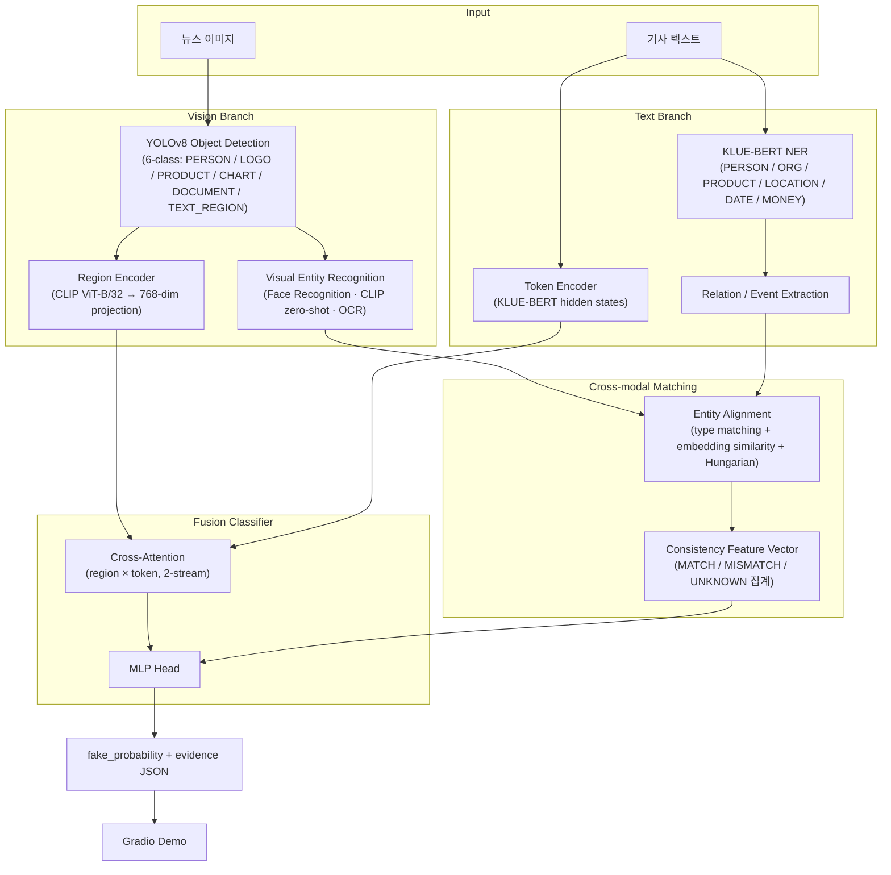

# FinFact Architecture Document

> Object-Level Multimodal Financial Misinformation Detection
> 작성자: Winston (BMAD Architect) · 작성일: 2026-08-10
> 참조 문서: `docs/bmad/project-brief.md`, `docs/ARCHITECTURE.md`

---

## Introduction

본 문서는 FinFact — 금융 뉴스 게시물(이미지 + 텍스트)에서 시각적 증거와 텍스트 주장의 entity 단위 불일치를 탐지하는 딥러닝 파이프라인 — 의 기술 아키텍처를 정의한다. `docs/ARCHITECTURE.md`의 상세 설계(텐서 차원, 스키마, 학습 전략)를 기반으로, BMAD 개발 프로세스에서 개발 에이전트가 참조할 표준 아키텍처 문서로 작성되었다.

핵심 설계 원칙:

- **Object-level 대조**: 이미지 전체 vs 텍스트 전체의 단일 CLIP similarity가 아니라, Object Detection으로 분해한 시각 증거(region)와 NER로 추출한 텍스트 주장(entity)을 word-region pair 수준에서 하나씩 대조한다 (EM-FEND, CFFN, Event-Radar 계열 접근).
- **모듈 독립성**: Vision Branch, Text Branch, Cross-modal Matching, Fusion Classifier를 독립 모듈로 분리하여 개별 학습·평가·교체가 가능하도록 한다 (단일 GPU 제약 대응).
- **Explainability**: 최종 Fake probability와 함께 "어떤 entity가 MISMATCH인지" evidence JSON을 출력한다.
- **Phase별 점진 개발**: P1 (ResNet+BERT late fusion baseline) → P2 (+YOLO region cross-attention) → P3 (+NER) → P4 (+entity consistency)로 단계별 완성하여 일정 리스크를 분산한다.

### Change Log

| Date | Version | Description | Author |
|---|---|---|---|
| 2026-08-10 | 1.0 | 최초 작성 (ARCHITECTURE.md 기반 BMAD 형식 정리) | Winston (Architect) |

---

## High Level Architecture

### Technical Summary

FinFact는 로컬 단일 GPU에서 동작하는 Python/PyTorch 기반 ML 파이프라인이다. 두 개의 병렬 branch — Vision Branch (YOLOv8 detection → visual entity recognition → CLIP region encoding)와 Text Branch (KLUE-BERT NER/relation extraction → token encoding) — 의 출력을 Cross-modal Matching 모듈이 entity 단위로 정렬하여 MATCH/MISMATCH/UNKNOWN을 판정하고, Fusion Classifier가 cross-attention feature와 consistency feature를 결합해 최종 Fake probability를 산출한다. 서비스 배포는 scope 밖이며, Gradio 데모가 유일한 사용자 인터페이스이다.

### High Level Diagram



### Architectural Patterns

- **Pipeline Architecture**: 각 단계가 명시적 JSON/tensor 스키마로 연결된 순차·병렬 파이프라인 — 모듈별 독립 개발/테스트 용이
- **Two-Stage Training**: Stage 1 모듈별 개별 학습 (YOLOv8, NER, relation head), Stage 2 fusion end-to-end fine-tuning (backbone frozen → 후반 partial unfreeze)
- **Late Binding of Pretrained Models**: CLIP, Face Recognition, OCR은 fine-tuning 없이 pretrained 그대로 사용, 후보군/DB만 구축 — 단일 GPU 학습 부담 최소화
- **Graceful Degradation**: 인식 실패 entity는 UNKNOWN으로 처리 (불일치가 아닌 "무증거") — 오류 전파 억제

---

## Tech Stack

| Category | Technology | Version | 선정 이유 |
|---|---|---|---|
| Language | Python | 3.10+ | ML 생태계 표준, 모든 라이브러리 호환 |
| DL Framework | PyTorch | 2.x (CUDA 지원) | 모든 모델의 공통 기반, 연구용 유연성, HuggingFace/Ultralytics 호환 |
| Object Detection | Ultralytics YOLOv8 | 8.x | pretrained COCO weights에서 6-class 커스텀 fine-tuning 용이, 단일 GPU에서 빠른 학습·추론, mAP 평가 내장 |
| NLP Models | HuggingFace Transformers | 4.x | KLUE-BERT fine-tuning (NER BIO tagging, relation classification), Trainer/tokenizer 인프라 |
| Text Backbone | KLUE-BERT (`klue/bert-base`) | base | 한국어 뉴스 텍스트 NER/RE에 검증된 backbone, KLUE NER 데이터셋과 label 체계 호환 |
| Vision-Language | OpenAI CLIP (ViT-B/32) | via `open_clip` 또는 HF | region feature 인코딩(512-dim) + LOGO/PRODUCT zero-shot 분류 + global image-text similarity — fine-tuning 없이 3가지 역할 수행 |
| Face Recognition | InsightFace (ArcFace) | 최신 stable | pretrained face embedding으로 인물 DB cosine similarity 매칭, 별도 학습 불필요 |
| OCR | PaddleOCR (대안: EasyOCR) | 2.x | 딥러닝 기반, 한국어/영어 지원, CHART/DOCUMENT/TEXT_REGION의 수치·날짜·티커 추출 |
| Matching | SciPy (`linear_sum_assignment`) | 1.x | Hungarian matching 표준 구현 |
| Demo UI | Gradio | 4.x | 이미지+텍스트 입력 → fake score + bbox/mismatch 시각화를 최소 코드로 구현, 발표 데모 적합 |
| Experiment Tracking | Weights & Biases (wandb) | 최신 | ablation 실험 관리, metric 곡선/비교 표 자동화 |
| Data | Fakeddit + KLUE NER + 커스텀 annotation | — | 공개 데이터셋 제약 하 최대 규모 멀티모달 가짜뉴스 데이터 |
| Config | YAML (PyYAML) + argparse | — | 실험 재현성 (하이퍼파라미터를 config 파일로 버전 관리) |
| Testing | pytest | 8.x | 모듈 단위 테스트 표준 |

> 버전은 개발 시작 시점의 stable 버전으로 고정하고 `requirements.txt`에 pin한다.

---

## Data Models

모듈 간 인터페이스는 아래 스키마로 고정한다 (상세 예시는 `docs/ARCHITECTURE.md` §2 참조).

### NewsSample (학습/추론 입력 단위)

```python
{
  "sample_id": str,
  "image_path": str,           # RGB 이미지
  "title": str,
  "body": str,
  "label": int | None,         # 0 = REAL, 1 = FAKE (추론 시 None)
  "source": str                # "fakeddit" | "custom_finance"
}
```

### Detection (YOLOv8 출력)

```python
{
  "region_id": int,
  "class_id": int,             # 0-5
  "class_name": str,           # PERSON | LOGO | PRODUCT | CHART | DOCUMENT | TEXT_REGION
  "bbox": [x1, y1, x2, y2],    # 원본 이미지 좌표
  "conf": float                # ≥ 0.4 필터, 이미지당 최대 R=16
}
```

### VisualEntity (Visual Entity Recognition 출력)

```python
{
  "region_id": int,
  "entity_type": str,          # PERSON | ORG | PRODUCT | MONEY | DATE | ...
  "value": str | None,         # 인식 실패 시 None → matching에서 UNKNOWN 후보
  "score": float,
  "source": str,               # "face_recognition" | "clip_zero_shot" | "ocr" | "unrecognized"
  "embedding": float32[512],   # CLIP image embedding
  "raw": dict                  # candidates, OCR raw text 등
}
```

### TextualEntity / Event (KLUE-BERT NER + RE 출력)

```python
# entity
{
  "entity_id": int,
  "type": str,                 # PERSON | ORG | PRODUCT | LOCATION | DATE | MONEY
  "text": str,
  "span": [start, end],
  "embedding": float32[768],   # span token mean pooling
  "normalized": Any | None     # MONEY/DATE 정규화 값
}

# event = (subject, relation, object) triple
{
  "event_id": int,
  "relation": str,             # CONTRACT_WITH | ACQUIRE | INVEST_IN | PARTNER_WITH | EARNINGS_OF | CEO_OF | PRICE_OF | NO_RELATION
  "subject": int,              # entity_id
  "object": int,
  "args": {"AMOUNT": int, "DATE": int},   # optional entity_id refs
  "score": float
}
```

### Alignment (Cross-modal Matching 출력)

```python
{
  "alignments": [
    {"region_id": int, "entity_id": int, "type": str, "sim": float,
     "verdict": "MATCH" | "MISMATCH" | "UNKNOWN"}
  ],
  "unmatched_visual": [int],
  "unmatched_textual": [int],
  "consistency_vector": float32[11]   # n_match, n_mismatch, n_unknown, sim 통계, type별 mismatch flag, global CLIP sim
}
```

판정 threshold: `sim ≥ 0.7` → MATCH, `sim < 0.4` ∧ 양측 confidence ≥ 0.6 → MISMATCH, 그 외 UNKNOWN.

### Prediction (최종 출력)

```python
{
  "fake_probability": float,
  "label": "FAKE" | "REAL",
  "threshold": 0.5,
  "evidence": [
    {"kind": "entity_mismatch" | "entity_match" | "no_visual_evidence",
     "visual": {...}, "textual": {...}, "sim": float, "verdict": str, "weight": float}
  ],
  "scores": {"global_clip_similarity": float, "n_match": int, "n_mismatch": int, "n_unknown": int}
}
```

---

## Components

### 1. Data Module (`src/data/`)

- **책임**: Fakeddit 다운로드/전처리, 금융 키워드 필터링 subset 구성, 커스텀 detection/NER annotation 로딩, PyTorch `Dataset`/`DataLoader` 제공
- **인터페이스**: `FinFactDataset → NewsSample`, split별 loader factory
- **의존성**: 없음 (파이프라인의 시작점)

### 2. Detector (`src/vision/detector.py`)

- **책임**: YOLOv8 6-class fine-tuning 및 추론. letterbox 640×640, conf ≥ 0.4, NMS IoU 0.5, 최대 16 regions
- **인터페이스**: `detect(image) -> List[Detection]`
- **의존성**: Ultralytics YOLOv8, Data Module (annotation)

### 3. Visual Entity Recognizer (`src/vision/entity_recognizer.py`)

- **책임**: Detection class별 라우팅 — PERSON→InsightFace 인물 DB 매칭(threshold 0.5), LOGO/PRODUCT→CLIP zero-shot(프롬프트 후보군), CHART/DOCUMENT/TEXT_REGION→OCR + regex 정규화(MONEY/DATE/PERCENT)
- **인터페이스**: `recognize(image, detections) -> List[VisualEntity]`
- **의존성**: Detector 출력, InsightFace, CLIP, PaddleOCR

### 4. Region Encoder (`src/vision/region_encoder.py`)

- **책임**: crop별 CLIP image feature (512-dim) + global image feature → Linear projection 768-dim, `V' ∈ R^{(R+1)×768}`
- **인터페이스**: `encode(image, detections) -> Tensor[(R+1), 768]`
- **의존성**: CLIP, Detector 출력

### 5. NER Module (`src/text/ner.py`)

- **책임**: KLUE-BERT BIO tagging fine-tuning, 6-type entity 추출, span embedding (mean pooling), MONEY/DATE 정규화
- **인터페이스**: `extract(title, body) -> List[TextualEntity]`, token hidden states `T ∈ R^{256×768}` 함께 반환
- **의존성**: HuggingFace Transformers, Data Module

### 6. Relation Extractor (`src/text/relation.py`)

- **책임**: entity marker (`[E1]…[/E1]`) 삽입 후 `[CLS]` 분류로 금융 relation 8종 추출, event triple 구성
- **인터페이스**: `extract_events(text, entities) -> List[Event]`
- **의존성**: NER Module 출력, KLUE-BERT backbone 공유

### 7. Cross-modal Matcher (`src/matching/matcher.py`)

- **책임**: type-compatible pair에 대해 embedding cosine (공통 공간 projection) 또는 정규화 값 비교 → score matrix → Hungarian matching → MATCH/MISMATCH/UNKNOWN 판정 → consistency vector (R^11) 집계
- **인터페이스**: `match(visual_entities, textual_entities) -> Alignment`
- **의존성**: Visual Entity Recognizer, NER Module 출력. 학습 파라미터 없음 (projection layer 제외)

### 8. Fusion Classifier (`src/fusion/classifier.py`)

- **책임**: 2-stream cross-attention (text→image, image→text; 2 layers, 8 heads, d=768) → pooled `h_t2v, h_v2t` + consistency `c' ∈ R^64` → concat 1600-dim → MLP(512→128→2) → softmax. Loss: class-weighted Cross-Entropy
- **인터페이스**: `forward(V', T, c) -> logits`, `predict(...) -> Prediction` (evidence weight 포함)
- **의존성**: Region Encoder, NER Module (token features), Matcher (consistency vector)

### 9. Inference Pipeline (`src/pipeline.py`)

- **책임**: 전체 모듈 orchestration (Vision/Text branch 병렬 실행 가능), Prediction JSON 조립
- **인터페이스**: `predict(image, title, body) -> Prediction`
- **의존성**: 위 모든 모듈

### 10. Demo (`demo/app.py`)

- **책임**: Gradio UI — 이미지+텍스트 입력, fake score, bbox overlay, mismatch entity 하이라이트 표시
- **의존성**: Inference Pipeline

### 11. Evaluation & Experiments (`experiments/`)

- **책임**: 컴포넌트별 평가 (mAP@50, NER F1, relation F1) + end-to-end 평가 (Accuracy/P/R/F1/AUROC) + ablation table 생성 (BERT only / image only / BERT+image / +object detection / +entity consistency)
- **의존성**: 전체 모듈, wandb

---

## Source Tree

```
Fake_news/
├── configs/                      # 실험 config (YAML)
│   ├── detector.yaml
│   ├── ner.yaml
│   ├── fusion.yaml
│   └── ablation/                 # ablation 변형별 config
├── data/                         # (gitignore) 데이터셋 원본·전처리 결과
│   ├── fakeddit/
│   ├── finance_subset/
│   └── annotations/              # detection bbox, NER 커스텀 라벨
├── src/
│   ├── data/                     # Dataset, 전처리, 필터링
│   │   ├── dataset.py
│   │   └── preprocess.py
│   ├── vision/
│   │   ├── detector.py           # YOLOv8 wrapper
│   │   ├── entity_recognizer.py  # Face / CLIP zero-shot / OCR 라우팅
│   │   └── region_encoder.py     # CLIP region features
│   ├── text/
│   │   ├── ner.py                # KLUE-BERT NER
│   │   ├── relation.py           # Relation/Event Extraction
│   │   └── normalize.py          # MONEY/DATE regex 정규화
│   ├── matching/
│   │   └── matcher.py            # Entity alignment + consistency vector
│   ├── fusion/
│   │   ├── classifier.py         # Cross-attention + MLP head
│   │   └── baseline.py           # Phase 1 ResNet+BERT late fusion
│   ├── pipeline.py               # end-to-end 추론 orchestration
│   └── utils/                    # 공통 (seed, logging, io)
├── scripts/
│   ├── train_detector.py
│   ├── train_ner.py
│   ├── train_relation.py
│   ├── train_fusion.py
│   └── evaluate.py               # 컴포넌트별 + end-to-end + ablation
├── experiments/                  # 실험 결과, ablation table 출력
├── demo/
│   └── app.py                    # Gradio 데모
├── tests/                        # pytest 모듈 단위 테스트
│   ├── test_detector.py
│   ├── test_ner.py
│   ├── test_matcher.py
│   └── test_pipeline.py
├── docs/
│   ├── ARCHITECTURE.md           # 상세 기술 설계 (본 문서의 근거)
│   └── bmad/                     # BMAD 산출물
├── requirements.txt
└── README.md
```

---

## Infrastructure and Deployment

- **실행 환경**: 로컬 단일 GPU (또는 Google Colab 동급). 분산 학습·모델 서빙 인프라는 scope 밖
- **자원 전략**: pretrained model 최대 활용 (YOLOv8 COCO, CLIP, KLUE-BERT), Stage 1 모듈별 독립 학습 → Stage 2 fusion만 end-to-end (YOLOv8/OCR/Face frozen, 후반 epoch에 BERT 상위 layer + CLIP projection unfreeze; backbone LR 1e-5, head LR 1e-4)
- **실험 추적**: wandb — run별 config/metric/ablation 비교 표 관리, 학습 곡선 기록. 오프라인 대안: CSV logging
- **재현성**: 고정 random seed, config YAML 버전 관리, `requirements.txt` 버전 pin, 학습된 checkpoint는 로컬 `checkpoints/` (gitignore) + 발표용 최종본만 별도 보관
- **배포**: 없음. Gradio 데모를 `python demo/app.py`로 로컬 실행 (발표 시연용)

---

## Coding Standards

- **Python 3.10+ / PEP 8**, formatter: `black`, linter: `ruff`, import 정렬: `ruff --select I`
- **Type hints 필수**: 모듈 공개 인터페이스 (위 Components의 함수 시그니처)에는 반드시 type hint를 붙인다
- **스키마 준수**: 모듈 간 데이터는 본 문서 Data Models 스키마를 따르며, 변경 시 본 문서와 `docs/ARCHITECTURE.md`를 함께 갱신한다
- **Config 우선**: 하이퍼파라미터·threshold(conf 0.4, τ_match 0.7, τ_mismatch 0.4 등)를 코드에 하드코딩하지 않고 `configs/*.yaml`에서 로드
- **Seed 고정**: 모든 학습 스크립트는 `utils.set_seed()` 호출로 시작
- **한국어 주석 허용, 식별자·docstring 용어는 영어** (entity, region, consistency 등 기술 용어 통일)
- **경로**: `pathlib.Path` 사용, 절대 경로 하드코딩 금지 (config 기반)

---

## Test Strategy

### 모듈 단위 테스트 (pytest, `tests/`)

| 대상 | 테스트 내용 |
|---|---|
| Detector | 출력 스키마 검증 (bbox 범위, conf filter, R ≤ 16), 더미 이미지 smoke test |
| Visual Entity Recognizer | class별 라우팅 정확성, 인식 실패 시 `value=None` 처리 |
| NER / Relation | 고정 예문 입력 → entity type/span/normalized 값 검증 |
| Normalize | MONEY/DATE regex 정규화 edge case ("20조원" → 2.0e13 등) |
| Matcher | type incompatible pair 제외, threshold 경계값에서 MATCH/MISMATCH/UNKNOWN 판정, Hungarian 1:1 보장 |
| Fusion | 텐서 차원 흐름 검증 (`V'[(R+1),768]`, `T[256,768]`, `c[11]` → `logits[2]`), forward/backward smoke test |
| Pipeline | end-to-end 추론이 Prediction 스키마를 만족하는지 (샘플 1건) |

### 평가 스크립트 (`scripts/evaluate.py`)

- **컴포넌트별**: Detector mAP@50/Precision/Recall, NER entity-level F1, Relation F1, CLIP zero-shot/Face top-1 accuracy
- **End-to-end**: Accuracy, Precision, Recall, F1, AUROC (Fakeddit test split + 금융 subset)
- **Ablation** (핵심 실험): BERT only → ResNet only → BERT+Image → +Object Detection → +Entity consistency 단계별 F1 비교 표 — entity consistency feature의 기여 입증이 목표
- **Error analysis**: MISMATCH 오탐/미탐 사례 수집 (성능 미달 시 원인 분석 자체를 기여로 제시)

### 실행 원칙

- 학습 없는 테스트(스키마·차원·로직)는 CPU에서 실행 가능하게 작성 (CI/저사양 환경 호환)
- pretrained model 로딩이 필요한 테스트는 `@pytest.mark.slow`로 분리

---

## Security and Ethics Considerations

### 오탐(False Positive) 시 위험

- 진짜 뉴스를 FAKE로 판정하면 정당한 언론·기업에 대한 명예훼손성 오판이 될 수 있다. 완화:
  - 출력은 이진 판정이 아닌 **확률 + evidence** — 데모/문서에 "판단 보조 도구이며 최종 판단은 사람이 한다"를 명시
  - UNKNOWN을 불일치로 취급하지 않는 보수적 판정 로직 (무증거 ≠ 거짓)
  - Precision/Recall trade-off를 ablation과 함께 보고하고, threshold(0.5)의 한계를 명시
- 반대로 미탐(False Negative)은 투자자 피해로 이어질 수 있음 — 본 시스템은 모더레이션 "우선순위 결정" 보조로만 포지셔닝 (project brief의 가상 시나리오 준수)

### 인물 인식·개인정보

- Face Recognition은 공인(CEO 등) 공개 이미지 DB에 한정하고, 일반인 식별 용도로 확장하지 않는다
- 인물 DB는 저장소에 커밋하지 않고 로컬 구성 (재현 절차만 문서화)

### 데이터 라이선스

- **Fakeddit**: 학술 연구 목적 공개 데이터셋 — 라이선스 조건(비상업적 연구 사용) 준수, 원본 재배포 금지 (다운로드 스크립트만 제공)
- **KLUE**: CC-BY-SA 계열 — 출처 표기
- **커스텀 annotation 이미지**: 공개 뉴스 이미지 사용 시 출처 기록, 발표 자료 인용 범위 내 사용
- pretrained model 라이선스 확인: YOLOv8(AGPL-3.0 — 과제/연구 사용은 문제없으나 배포 시 주의), CLIP(MIT), KLUE-BERT(CC-BY-SA), PaddleOCR(Apache-2.0)

### 악용 방지

- 본 프로젝트는 탐지 목적이며, mismatch 패턴 분석 결과가 "탐지 회피형 가짜뉴스 제작"에 쓰이지 않도록 error analysis의 상세 회피 기법은 발표 자료에서 일반화 수준으로만 공유

---

## 참고 문서

- `docs/bmad/project-brief.md` — 요구사항·성공 지표·리스크 (Mary, Analyst)
- `docs/ARCHITECTURE.md` — 텐서 차원, JSON 스키마, 학습 하이퍼파라미터 상세 설계
- EM-FEND (arXiv:2108.10509), CFFN (arXiv:2311.01807), Event-Radar (ACL 2024), Fakeddit (arXiv:1911.03854)
