# FinFact Architecture Document

> Object-Level Multimodal Financial Misinformation Detection
> 작성자: Winston (BMAD Architect) · 작성일: 2026-08-10
> 참조 문서: `docs/bmad/project-brief.md`, `docs/ARCHITECTURE.md`

---

## Introduction

본 문서는 FinFact — 금융 뉴스 게시물(이미지 + 텍스트)에서 시각적 증거와 텍스트 주장의 entity 단위 불일치를 탐지하는 딥러닝 파이프라인 — 의 기술 아키텍처를 정의한다. `docs/ARCHITECTURE.md`의 상세 설계(텐서 차원, 스키마, 학습 전략)를 기반으로, BMAD 개발 프로세스에서 개발 에이전트가 참조할 표준 아키텍처 문서로 작성되었다.

핵심 설계 원칙:

- **Object-level 대조**: 이미지 전체 vs 텍스트 전체의 단일 CLIP similarity가 아니라, Object Detection으로 분해한 시각 증거(region)와 NER로 추출한 텍스트 주장(entity)을 word-region pair 수준에서 하나씩 대조한다 (EM-FEND, CFFN, Event-Radar 계열 접근).
- **모듈 독립성**: Vision Branch, Text Branch, Cross-modal Matching, Fusion Classifier를 독립 모듈로 분리하여 개별 학습·평가·교체가 가능하도록 한다 (단일 GPU 제약 대응).
- **Explainability**: 최종 Fake probability와 함께 "어떤 entity가 MISMATCH인지" evidence JSON을 출력한다.
- **Phase별 점진 개발**: P1 (ResNet+BERT late fusion baseline) → P2 (+YOLO region cross-attention) → P3 (+NER) → P4 (+entity consistency)로 단계별 완성하여 일정 리스크를 분산한다.

### Change Log

| Date | Version | Description | Author |
|---|---|---|---|
| 2026-08-10 | 1.0 | 최초 작성 (ARCHITECTURE.md 기반 BMAD 형식 정리) | Winston (Architect) |
| 2026-08-10 | 1.1 | Epic 1(Story 1.1~1.4) 구현과의 drift 정정: Source Tree/Components를 실제 구조로 갱신(구현/계획 구분), Text Backbone을 영어 BERT 주 실험 + KLUE-BERT 한국어 데모 전용으로 정정, 실험 추적을 CSV/TensorBoard 우선(wandb optional)으로 정정, "Architecture Contracts" 절 신설(모델 계약·레지스트리·config 상속·인코더 재사용), Epic 2 진입 시 `proj_dim: 768` 요구 명시, Test Strategy 실제 테스트 파일 반영 | Winston (Architect) |

---

## High Level Architecture

### Technical Summary

FinFact는 로컬 단일 GPU에서 동작하는 Python/PyTorch 기반 ML 파이프라인이다. 두 개의 병렬 branch — Vision Branch (YOLOv8 detection → visual entity recognition → CLIP region encoding)와 Text Branch (BERT 계열 NER/relation extraction → token encoding; 주 실험은 영어 `bert-base-uncased`/DeBERTa, 한국어 데모에서만 KLUE-BERT) — 의 출력을 Cross-modal Matching 모듈이 entity 단위로 정렬하여 MATCH/MISMATCH/UNKNOWN을 판정하고, Fusion Classifier가 cross-attention feature와 consistency feature를 결합해 최종 Fake probability를 산출한다. 서비스 배포는 scope 밖이며, Gradio 데모가 유일한 사용자 인터페이스이다.

### High Level Diagram

```mermaid
flowchart TB
    subgraph Input
        IMG[뉴스 이미지]
        TXT[기사 텍스트]
    end

    subgraph VisionBranch["Vision Branch"]
        DET["YOLOv8 Object Detection<br/>(6-class: PERSON / LOGO / PRODUCT / CHART / DOCUMENT / TEXT_REGION)"]
        VER["Visual Entity Recognition<br/>(Face Recognition · CLIP zero-shot · OCR)"]
        RENC["Region Encoder<br/>(CLIP ViT-B/32 → 768-dim projection)"]
    end

    subgraph TextBranch["Text Branch"]
        NER["BERT-family NER<br/>(en: bert-base-uncased / DeBERTa · ko demo: KLUE-BERT)<br/>(PERSON / ORG / PRODUCT / LOCATION / DATE / MONEY)"]
        REL["Relation / Event Extraction"]
        TENC["Token Encoder<br/>(BERT hidden states, 768-dim)"]
    end

    subgraph CrossModal["Cross-modal Matching"]
        ALIGN["Entity Alignment<br/>(type matching + embedding similarity + Hungarian)"]
        CONS["Consistency Feature Vector<br/>(MATCH / MISMATCH / UNKNOWN 집계)"]
    end

    subgraph Fusion["Fusion Classifier"]
        XATT["Cross-Attention<br/>(region × token, 2-stream)"]
        MLP["MLP Head"]
    end

    OUT["fake_probability + evidence JSON"]
    DEMO["Gradio Demo"]

    IMG --> DET --> VER
    DET --> RENC
    TXT --> NER --> REL
    TXT --> TENC
    VER --> ALIGN
    REL --> ALIGN
    ALIGN --> CONS
    RENC --> XATT
    TENC --> XATT
    XATT --> MLP
    CONS --> MLP
    MLP --> OUT --> DEMO
```



### Architectural Patterns

- **Pipeline Architecture**: 각 단계가 명시적 JSON/tensor 스키마로 연결된 순차·병렬 파이프라인 — 모듈별 독립 개발/테스트 용이
- **Two-Stage Training**: Stage 1 모듈별 개별 학습 (YOLOv8, NER, relation head), Stage 2 fusion end-to-end fine-tuning (backbone frozen → 후반 partial unfreeze)
- **Late Binding of Pretrained Models**: CLIP, Face Recognition, OCR은 fine-tuning 없이 pretrained 그대로 사용, 후보군/DB만 구축 — 단일 GPU 학습 부담 최소화
- **Graceful Degradation**: 인식 실패 entity는 UNKNOWN으로 처리 (불일치가 아닌 "무증거") — 오류 전파 억제

---

## Tech Stack

| Category | Technology | Version | 선정 이유 |
|---|---|---|---|
| Language | Python | 3.10+ | ML 생태계 표준, 모든 라이브러리 호환 |
| DL Framework | PyTorch | 2.x (CUDA 지원) | 모든 모델의 공통 기반, 연구용 유연성, HuggingFace/Ultralytics 호환 |
| Object Detection | Ultralytics YOLOv8 | 8.x | pretrained COCO weights에서 6-class 커스텀 fine-tuning 용이, 단일 GPU에서 빠른 학습·추론, mAP 평가 내장 |
| NLP Models | HuggingFace Transformers | 4.x | 텍스트 인코더/NER BIO tagging/relation classification fine-tuning, tokenizer 인프라 |
| Text Backbone (주 실험) | **`bert-base-uncased`** (여유 시 DeBERTa 비교) | base | 주 데이터셋 Fakeddit이 **영어**이므로 영어 backbone이 기준이다. hidden 768-dim — fusion 공통 차원 `d=768`과 정합. Story 1.3/1.4 구현(`configs/{bert_only,late_fusion}.yaml`)이 이 값을 사용 |
| Text Backbone (한국어 데모 전용) | KLUE-BERT (`klue/bert-base`) | base | **자체 한국어 금융 데모/평가 셋에만** 적용. 한국어 NER/RE에 검증된 backbone이며 hidden도 768-dim이라 동일 인터페이스로 교체 가능(`model.text.model_name`만 변경). 주 ablation table의 수치는 영어 backbone으로 산출한다 |
| Vision-Language | OpenAI CLIP (ViT-B/32) | via `open_clip` 또는 HF | region feature 인코딩(512-dim) + LOGO/PRODUCT zero-shot 분류 + global image-text similarity — fine-tuning 없이 3가지 역할 수행 |
| Face Recognition | InsightFace (ArcFace) | 최신 stable | pretrained face embedding으로 인물 DB cosine similarity 매칭, 별도 학습 불필요 |
| OCR | PaddleOCR (대안: EasyOCR) | 2.x | 딥러닝 기반, 한국어/영어 지원, CHART/DOCUMENT/TEXT_REGION의 수치·날짜·티커 추출 |
| Matching | SciPy (`linear_sum_assignment`) | 1.x | Hungarian matching 표준 구현 |
| Demo UI | Gradio | 4.x | 이미지+텍스트 입력 → fake score + bbox/mismatch 시각화를 최소 코드로 구현, 발표 데모 적합 |
| Image Backbone (baseline) | torchvision ResNet-50 (ImageNet) | — | Story 1.3/1.4 구현 기준. pooled feature **2048-dim** (`proj_dim`으로 768 정렬 가능 — 아래 Epic 2 주의 참조) |
| Experiment Tracking | **CSV(`history.csv`) + TensorBoard** (구현됨) / wandb (optional, 미구현) | — | 오프라인·단일 GPU 환경을 기본 가정하므로 `src/utils/logging.py`의 `build_logger(backend="csv"\|"tensorboard")`가 실제 경로다. config `logging.backend`로 선택. wandb는 `requirements.txt`에만 존재하는 **선택적 확장**이며 코드 경로가 없다 |
| Data | Fakeddit + KLUE NER + 커스텀 annotation | — | 공개 데이터셋 제약 하 최대 규모 멀티모달 가짜뉴스 데이터 |
| Config | YAML (PyYAML) + argparse | — | 실험 재현성 (하이퍼파라미터를 config 파일로 버전 관리) |
| Testing | pytest | 8.x | 모듈 단위 테스트 표준 |

> 버전은 개발 시작 시점의 stable 버전으로 고정하고 `requirements.txt`에 pin한다.

---

## Data Models

모듈 간 인터페이스는 아래 스키마로 고정한다 (상세 예시는 `docs/ARCHITECTURE.md` §2 참조).

### NewsSample (학습/추론 입력 단위)

```python
{
  "sample_id": str,
  "image_path": str,           # RGB 이미지
  "title": str,
  "body": str,
  "label": int | None,         # 0 = REAL, 1 = FAKE (추론 시 None)
  "source": str                # "fakeddit" | "custom_finance"
}
```

### Detection (YOLOv8 출력)

```python
{
  "region_id": int,
  "class_id": int,             # 0-5
  "class_name": str,           # PERSON | LOGO | PRODUCT | CHART | DOCUMENT | TEXT_REGION
  "bbox": [x1, y1, x2, y2],    # 원본 이미지 좌표
  "conf": float                # ≥ 0.4 필터, 이미지당 최대 R=16
}
```

### VisualEntity (Visual Entity Recognition 출력)

```python
{
  "region_id": int,
  "entity_type": str,          # PERSON | ORG | PRODUCT | MONEY | DATE | ...
  "value": str | None,         # 인식 실패 시 None → matching에서 UNKNOWN 후보
  "score": float,
  "source": str,               # "face_recognition" | "clip_zero_shot" | "ocr" | "unrecognized"
  "embedding": float32[512],   # CLIP image embedding
  "raw": dict                  # candidates, OCR raw text 등
}
```

### TextualEntity / Event (NER + RE 출력)

```python
# entity
{
  "entity_id": int,
  "type": str,                 # PERSON | ORG | PRODUCT | LOCATION | DATE | MONEY
  "text": str,
  "span": [start, end],
  "embedding": float32[768],   # span token mean pooling
  "normalized": Any | None     # MONEY/DATE 정규화 값
}

# event = (subject, relation, object) triple
{
  "event_id": int,
  "relation": str,             # CONTRACT_WITH | ACQUIRE | INVEST_IN | PARTNER_WITH | EARNINGS_OF | CEO_OF | PRICE_OF | NO_RELATION
  "subject": int,              # entity_id
  "object": int,
  "args": {"AMOUNT": int, "DATE": int},   # optional entity_id refs
  "score": float
}
```

### Alignment (Cross-modal Matching 출력)

```python
{
  "alignments": [
    {"region_id": int, "entity_id": int, "type": str, "sim": float,
     "verdict": "MATCH" | "MISMATCH" | "UNKNOWN"}
  ],
  "unmatched_visual": [int],
  "unmatched_textual": [int],
  "consistency_vector": float32[11]   # n_match, n_mismatch, n_unknown, sim 통계, type별 mismatch flag, global CLIP sim
}
```

판정 threshold: `sim ≥ 0.7` → MATCH, `sim < 0.4` ∧ 양측 confidence ≥ 0.6 → MISMATCH, 그 외 UNKNOWN.

### Prediction (최종 출력)

```python
{
  "fake_probability": float,
  "label": "FAKE" | "REAL",
  "threshold": 0.5,
  "evidence": [
    {"kind": "entity_mismatch" | "entity_match" | "no_visual_evidence",
     "visual": {...}, "textual": {...}, "sim": float, "verdict": str, "weight": float}
  ],
  "scores": {"global_clip_similarity": float, "n_match": int, "n_mismatch": int, "n_unknown": int}
}
```

---

## Components

> 상태 표기: **[구현됨]** = Epic 1(Story 1.1~1.4)에서 코드가 존재하는 모듈, **[계획]** = 해당 Epic에서 추가될 모듈(현재 코드 없음).

### 0. Cross-cutting: Utils · Training · Evaluation **[구현됨 — Story 1.1]**

architecture 1.0에는 없었으나 실제 구현의 중심축이다. Phase/Epic 전체가 이 세 모듈을 공유한다.

- **`src/utils/`** — `config.py`(`Config`, `load_config`: `_base_` 상속 + `--set` 오버라이드 + 필수 키 검증), `seed.py`(`set_seed`, `seed_worker`, `torch_generator`), `logging.py`(`CSVLogger` / `TensorBoardLogger` / `build_logger`)
- **`src/training/trainer.py`** — 공통 `Trainer`(`fit`/`train_epoch`/`evaluate`/`save_checkpoint`/`load_checkpoint`), AMP·grad clip·early stopping·best checkpoint(monitor 지표) 지원. **모든 Phase의 모델이 이 Trainer 하나를 공유한다.**
- **`src/evaluation/`** — `metrics.py`(Accuracy/P/R/F1/AUROC, `save_metrics`), `ablation.py`(실험별 `metrics.json` 수집 → ablation 표 CSV/Markdown 생성, `f1_comparison`)

### 1. Data Module (`src/data/`) **[구현됨 — Story 1.2]**

- **책임**: Fakeddit 전처리/분할/금융 subset 구성, PyTorch `Dataset`/`DataLoader` 제공
- **실제 파일**:
  - `labels.py` — `FAKEDDIT_2WAY_TO_INTERNAL = {1: 0, 0: 1}`(원본 1=real ↔ 내부 1=FAKE, **반전 매핑**), `map_fakeddit_2way_label()`
  - `preprocess.py` — 원본 tsv → 클린 manifest(`sample_id, image_path, title, body, text, label, source`), 결측/손상 이미지 제거, `read_manifest()`
  - `splits.py` — seed 고정 stratified 분할(입력 행 순서 불변) 또는 공식 분할 사용
  - `financial.py` — config `data.financial_keywords` 기반 금융 subset 필터 + 리포트 (FR11)
  - `fakeddit.py` — `FakedditDataset` + 자체 `collate_fn`, `data.modality`(`text`/`image`/`both`), 이미지 transform(224, ImageNet mean/std), HF tokenizer 주입(오프라인 시 `tokenizer.name: null` → raw text)
  - `registry.py` — `register_dataset` / `build_dataset` / `build_dataloaders`, 스캐폴딩용 `dummy` 데이터셋
- **의존성**: 없음 (파이프라인의 시작점)
- **[계획]** 커스텀 detection/NER annotation 로딩은 Epic 2~4에서 추가

### 2. Baseline Encoders & Classifiers (`src/fusion/`) **[구현됨 — Story 1.3~1.4]**

- **`encoders.py`** — `TextEncoder`(HF BERT 계열, `pooling: cls|mean`, 기본 **768**-dim), `ImageEncoder`(torchvision ResNet, resnet50 pooled **2048**-dim), `ClassificationHead`(MLP). 인코더는 **분류 head를 갖지 않고** `forward(batch) -> features [B, D]` + `output_dim` + `freeze()/unfreeze()`만 제공한다 → Epic 2 이후 fusion이 그대로 재사용
- **`baseline.py`** — `SingleModalClassifier`(`text_only`/`image_only`), `LateFusionClassifier`(concat 768+2048=2816 → MLP head, `freeze_encoders`, `save_encoders()/load_encoders()`), `predict_single()`/`build_single_sample_batch()`
- **`registry.py`** — `register_model` / `build_model`, config `model.name`으로 선택 (`dummy`, `text_only`, `image_only`, `late_fusion`)
- **[계획 — Epic 2 이후]** `classifier.py`(cross-attention + MLP head)는 아직 없다. 아래 §8 참조

### 3. Detector (`src/vision/detector.py`) **[계획 — Epic 2]**

- **책임**: YOLOv8 6-class fine-tuning 및 추론. letterbox 640×640, conf ≥ 0.4, NMS IoU 0.5, 최대 16 regions
- **인터페이스**: `detect(image) -> List[Detection]`
- **의존성**: Ultralytics YOLOv8, Data Module (annotation)

### 4. Visual Entity Recognizer (`src/vision/entity_recognizer.py`) **[계획 — Epic 2·4]**

- **책임**: Detection class별 라우팅 — PERSON→InsightFace 인물 DB 매칭(threshold 0.5), LOGO/PRODUCT→CLIP zero-shot(프롬프트 후보군), CHART/DOCUMENT/TEXT_REGION→OCR + regex 정규화(MONEY/DATE/PERCENT)
- **인터페이스**: `recognize(image, detections) -> List[VisualEntity]`
- **의존성**: Detector 출력, InsightFace, CLIP, PaddleOCR

### 5. Region Encoder (`src/vision/region_encoder.py`) **[계획 — Epic 2]**

- **책임**: crop별 CLIP image feature (512-dim) + global image feature → Linear projection 768-dim, `V' ∈ R^{(R+1)×768}`
- **인터페이스**: `encode(image, detections) -> Tensor[(R+1), 768]`
- **의존성**: CLIP, Detector 출력
- ⚠️ **차원 정합 주의**: Epic 1의 `ImageEncoder`는 기본 `proj_dim: null`이라 ResNet-50 pooled feature를 **2048-dim 그대로** 노출한다(late fusion concat 768+2048=2816 전제). 반면 본 문서의 cross-attention fusion은 **공통 768-dim**을 전제하므로, Epic 2에서 `ImageEncoder`를 재사용해 region/global feature를 만들 때는 config에 **`model.image.proj_dim: 768`을 반드시 명시**해야 한다. (CLIP 경로를 쓰는 경우에도 512→768 Linear projection이 동일하게 필요하다.)

### 6. NER Module (`src/text/ner.py`) **[계획 — Epic 3]**

- **책임**: BERT 계열(영어 주 실험 `bert-base-uncased`/DeBERTa, 한국어 데모는 KLUE-BERT) BIO tagging fine-tuning, 6-type entity 추출, span embedding (mean pooling), MONEY/DATE 정규화
- **인터페이스**: `extract(title, body) -> List[TextualEntity]`, token hidden states `T ∈ R^{256×768}` 함께 반환
- **의존성**: HuggingFace Transformers, Data Module

### 7. Relation Extractor (`src/text/relation.py`) **[계획 — Epic 3]**

- **책임**: entity marker (`[E1]…[/E1]`) 삽입 후 `[CLS]` 분류로 금융 relation 8종 추출, event triple 구성
- **인터페이스**: `extract_events(text, entities) -> List[Event]`
- **의존성**: NER Module 출력, 텍스트 backbone 공유

### 8. Cross-modal Matcher (`src/matching/matcher.py`) **[계획 — Epic 4]**

- **책임**: type-compatible pair에 대해 embedding cosine (공통 공간 projection) 또는 정규화 값 비교 → score matrix → Hungarian matching → MATCH/MISMATCH/UNKNOWN 판정 → consistency vector (R^11) 집계
- **인터페이스**: `match(visual_entities, textual_entities) -> Alignment`
- **의존성**: Visual Entity Recognizer, NER Module 출력. 학습 파라미터 없음 (projection layer 제외)

### 9. Fusion Classifier (`src/fusion/classifier.py`) **[계획 — Epic 2·4]**

- **책임**: 2-stream cross-attention (text→image, image→text; 2 layers, 8 heads, d=768) → pooled `h_t2v, h_v2t` + consistency `c' ∈ R^64` → concat 1600-dim → MLP(512→128→2) → softmax. Loss: class-weighted Cross-Entropy
- **인터페이스**: `forward(V', T, c) -> logits`, `predict(...) -> Prediction` (evidence weight 포함)
- **의존성**: Region Encoder, NER Module (token features), Matcher (consistency vector)
- **현 상태**: 미구현. Epic 1의 baseline은 `src/fusion/baseline.py`의 `LateFusionClassifier`(concat + MLP)이며, cross-attention 모델은 Epic 2에서 `classifier.py`로 추가하되 아래 **Architecture Contracts**의 `forward(batch) -> logits [B,2]` 계약과 `@register_model` 등록을 따라야 Trainer 수정 없이 교체된다.

### 10. Inference Pipeline (`src/pipeline.py`) **[계획 — Epic 4·5]**

- **책임**: 전체 모듈 orchestration (Vision/Text branch 병렬 실행 가능), Prediction JSON 조립
- **인터페이스**: `predict(image, title, body) -> Prediction`
- **의존성**: 위 모든 모듈
- **현 상태**: 미구현. 단일 샘플 추론의 Epic 1 대응물은 `scripts/predict.py` + `src/fusion/baseline.py::predict_single()`(`{fake_prob, label, label_name, elapsed_sec}` 반환)이다.

### 11. Demo (`demo/app.py`) **[계획 — Epic 5]**

- **책임**: Gradio UI — 이미지+텍스트 입력, fake score, bbox overlay, mismatch entity 하이라이트 표시
- **의존성**: Inference Pipeline

### 12. Evaluation & Experiments **[일부 구현됨 — Story 1.1·1.4]**

- **실제 위치**: 로직은 `src/evaluation/{metrics,ablation}.py`, CLI는 `scripts/{evaluate,collect_ablation}.py`, **결과 산출물은 `experiments/`가 아니라 `outputs/<exp_name>/`**(config 사본·`best.pt`·`history.csv`·`metrics.json`)이며 ablation 표는 `outputs/ablation_table.csv` + `docs/bmad/results/ablation.md`로 생성된다
- **구현됨**: end-to-end 분류 평가(Accuracy/P/R/F1/AUROC), ablation 표 자동 수집·렌더링, F1 개선폭 비교
- **[계획]**: 컴포넌트별 평가(mAP@50, NER F1, relation F1)는 Epic 2~4에서 추가
- **의존성**: 전체 모듈, CSV/TensorBoard 로깅(wandb는 optional·미구현)

---

## Architecture Contracts (모듈 교체 계약)

NFR6(ablation을 위한 모듈 교체 가능성)의 **실제 구현 수단**이다. Epic 2~5에서 새 모델/데이터셋을 추가할 때 아래 계약만 지키면 `Trainer`·`scripts/train.py`·`scripts/evaluate.py`를 수정하지 않고 config만 바꿔 갈아끼울 수 있다. 계약을 바꿔야 한다면 코드와 본 문서를 **함께** 갱신한다.

### C1. 모델 계약

```python
model(batch: dict) -> logits: Tensor  # shape [B, 2] (num_classes=2)
```

- 모델의 유일한 입력은 **batch dict**다. 모달 추가(region features, entity features, consistency vector 등)는 **키 추가**로 하며 시그니처를 바꾸지 않는다.
- 선택 인터페이스(있으면 자동 활용됨): `encode(batch) -> [B, D]`(penultimate feature), `param_groups(encoder_lr, head_lr)`(`scripts/train.py`가 lr 차등에 사용), `predict_proba(batch)`.

### C2. 배치 스키마 / 라벨 키

- 정답 라벨 키는 반드시 **`label`** (`int64 [B]`, `0=REAL / 1=FAKE`). `Trainer`가 이 키로 loss/metric을 계산한다.
- 모달 키: `input_ids`/`attention_mask`(또는 tokenizer 미사용 시 `text`), `image` `[B,3,H,W]`. `data.modality`(`text`/`image`/`both`)가 어떤 키를 채울지 결정한다.
- Dataset이 `collate_fn` 속성을 가지면 `build_dataloaders`가 자동으로 사용한다.

### C3. 레지스트리

- 데이터셋: `@register_dataset("<name>")` (`src/data/registry.py`) → config `data.name`
- 모델: `@register_model("<name>")` (`src/fusion/registry.py`) → config `model.name`
- 빌더 시그니처: `build(cfg: Config, split: str) -> Dataset`, `build(cfg: Config) -> nn.Module`
- 현재 등록: 데이터셋 `dummy`, `fakeddit` / 모델 `dummy`, `text_only`, `image_only`, `late_fusion`

### C4. Config 상속 + 오버라이드

- `configs/*.yaml`은 `_base_: <path>`로 상위 config를 상속하고(재귀·상대경로 허용, deep merge) 필요한 키만 덮어쓴다. 실제 계층: `base.yaml` ← `fakeddit.yaml` ← `{bert_only, resnet_only, late_fusion}.yaml`
- CLI `--set key.path=value`가 **마지막에** 적용된다 (예: `--set model.text.pretrained=false exp_name=smoke device=cpu`). ablation 변형은 새 파일 대신 `--set`으로도 표현 가능하다.
- 필수 키 검증(`REQUIRED_KEYS`)과 실행 시 `outputs/<exp_name>/config.yaml` 사본 저장으로 재현성을 보장한다 (NFR3).

### C5. 인코더 재사용 (Phase 간 전이)

- 인코더는 분류 head와 분리되어 `forward(batch) -> [B, D]` + `output_dim` + `freeze()/unfreeze()`만 제공한다.
- `SingleModalClassifier.save_encoder()/load_encoder()`, `LateFusionClassifier.save_encoders()/load_encoders()`로 **인코더 가중치만** 저장·로딩한다. config `model.text.checkpoint` / `model.image.checkpoint`에 경로를 주면 Story 1.3 산출물을 Story 1.4 이후 모델이 그대로 재사용한다.
- 공통 hidden dim은 **768**(`DEFAULT_HIDDEN_DIM`)이다. 768이 아닌 인코더(ResNet-50 2048, CLIP 512)를 fusion에 넣을 때는 `proj_dim: 768`로 정렬한다.

---

## Source Tree

`✅` = Epic 1(Story 1.1~1.4)에서 **실제 구현된** 경로, `⬜` = 해당 Epic에서 추가될 **계획** 경로(현재 없음).

```
Fake_news/
├── configs/                          ✅ 실험 config (YAML, `_base_` 상속)
│   ├── base.yaml                     ✅ 루트 config (seed/device/output_dir/train/logging)
│   ├── fakeddit.yaml                 ✅ _base_: base — 데이터 파이프라인·금융 키워드
│   ├── bert_only.yaml                ✅ _base_: fakeddit — ablation A1
│   ├── resnet_only.yaml              ✅ _base_: fakeddit — ablation A2
│   ├── late_fusion.yaml              ✅ _base_: fakeddit — ablation A3
│   └── ablation/                     ⬜ Epic 2~4 변형 config
├── data/                             (gitignore) 데이터셋 원본·전처리 결과
│   ├── fakeddit/{raw,images,processed}/
│   └── annotations/                  ⬜ detection bbox, NER 커스텀 라벨 (Epic 2~4)
├── src/
│   ├── data/                         ✅ 라벨·전처리·분할·금융 subset·Dataset·레지스트리
│   │   ├── labels.py                 ✅ Fakeddit 2-way ↔ 내부 라벨(0=REAL,1=FAKE) 반전 매핑
│   │   ├── preprocess.py             ✅ 클린 manifest 생성 / read_manifest
│   │   ├── splits.py                 ✅ seed 고정 stratified 분할 (또는 공식 분할)
│   │   ├── financial.py              ✅ 금융 키워드 subset 필터 (FR11)
│   │   ├── fakeddit.py               ✅ FakedditDataset + collate_fn (text/image/both)
│   │   └── registry.py               ✅ register_dataset / build_dataset / build_dataloaders
│   ├── fusion/                       ✅ 인코더·baseline 분류기·모델 레지스트리
│   │   ├── encoders.py               ✅ TextEncoder(768) / ImageEncoder(2048) / ClassificationHead
│   │   ├── baseline.py               ✅ SingleModalClassifier · LateFusionClassifier · predict_single
│   │   ├── registry.py               ✅ register_model / build_model
│   │   └── classifier.py             ⬜ Cross-attention + MLP head (Epic 2·4)
│   ├── training/                     ✅ 전 Phase 공용 Trainer
│   │   └── trainer.py                ✅ fit/evaluate/checkpoint/early stopping/AMP
│   ├── evaluation/                   ✅ 공통 지표 + ablation 표
│   │   ├── metrics.py                ✅ Accuracy/P/R/F1/AUROC, save_metrics
│   │   └── ablation.py               ✅ metrics.json 수집 → CSV/Markdown 표
│   ├── utils/                        ✅ config(_base_ 상속·--set) / seed / logging(CSV·TB)
│   ├── vision/                       ⬜ detector.py, entity_recognizer.py, region_encoder.py (Epic 2·4)
│   ├── text/                         ⬜ ner.py, relation.py, normalize.py (Epic 3)
│   ├── matching/                     ⬜ matcher.py (Epic 4)
│   └── pipeline.py                   ⬜ end-to-end 추론 orchestration (Epic 4·5)
├── scripts/                          ✅ 얇은 CLI 래퍼 (로직은 src/에)
│   ├── train.py                      ✅ **범용 학습** — config의 data.name/model.name으로 분기
│   ├── evaluate.py                   ✅ 저장된 checkpoint로 split 평가
│   ├── predict.py                    ✅ 단일 샘플 추론 (fake_prob + elapsed_sec)
│   ├── collect_ablation.py           ✅ 실험별 metrics.json → ablation 표
│   ├── download_fakeddit.py          ✅ 원본 재배포 없이 준비 안내/점검
│   ├── preprocess_fakeddit.py        ✅ manifest + 고정 분할 생성
│   └── filter_financial.py           ✅ 금융 subset manifest
│   (모듈별 train_detector/train_ner/train_relation/train_fusion 스크립트는 두지 않는다 —
│    새 모델은 레지스트리에 등록하고 config만 추가해 동일한 train.py로 학습한다)
├── outputs/                          ✅ 실험 산출물 (구 문서의 `experiments/`를 대체)
│   └── <exp_name>/                   ✅ config.yaml · best.pt · history.csv · metrics.json
│   └── ablation_table.csv            ✅ collect_ablation.py 출력
├── demo/                             ⬜ app.py — Gradio 데모 (Epic 5)
├── tests/                            ✅ pytest (Story 1.1~1.4 기준 전부 CPU 실행 가능)
├── docs/
│   ├── ARCHITECTURE.md               상세 기술 설계 (본 문서의 근거)
│   ├── DEV_PLAN.md                   Phase별 개발 계획 (Phase↔Epic 매핑 포함)
│   ├── DATA.md                       데이터 준비 규약
│   └── bmad/                         BMAD 산출물 (prd, architecture, stories, results)
├── requirements.txt
└── README.md
```

---

## Infrastructure and Deployment

- **실행 환경**: 로컬 단일 GPU (또는 Google Colab 동급). 분산 학습·모델 서빙 인프라는 scope 밖
- **자원 전략**: pretrained model 최대 활용 (YOLOv8 COCO, CLIP, BERT 계열), Stage 1 모듈별 독립 학습 → Stage 2 fusion만 end-to-end (YOLOv8/OCR/Face frozen, 후반 epoch에 BERT 상위 layer + CLIP projection unfreeze; backbone LR 1e-5, head LR 1e-4)
- **실험 추적** (구현 기준): **CSV logging이 기본**이다 — 실행마다 `outputs/<exp_name>/`에 `config.yaml`(사본)·`best.pt`·`history.csv`·`metrics.json`이 남고, `scripts/collect_ablation.py`가 이 파일들을 읽어 ablation 비교 표를 만든다. config `logging.backend: csv | tensorboard`로 전환하며 TensorBoard는 동일 디렉토리에 event를 기록한다. **wandb는 optional**(현재 코드 경로 없음, `requirements.txt`에만 존재) — 도입 시 `src/utils/logging.py`에 `ExperimentLogger` 프로토콜을 만족하는 backend를 추가하고 본 문서를 함께 갱신한다
- **재현성**: 고정 random seed(`src/utils/seed.py`, DataLoader worker seed 포함), 실행별 config 사본 저장, `requirements.txt` 버전 pin, checkpoint는 `outputs/<exp_name>/best.pt`(gitignore) + 발표용 최종본만 별도 보관
- **배포**: 없음. Gradio 데모를 `python demo/app.py`로 로컬 실행 (발표 시연용)

---

## Coding Standards

- **Python 3.10+ / PEP 8**, formatter: `black`, linter: `ruff`, import 정렬: `ruff --select I`
- **Type hints 필수**: 모듈 공개 인터페이스 (위 Components의 함수 시그니처)에는 반드시 type hint를 붙인다
- **스키마 준수**: 모듈 간 데이터는 본 문서 Data Models 스키마를 따르며, 변경 시 본 문서와 `docs/ARCHITECTURE.md`를 함께 갱신한다
- **계약 준수**: 새 모델/데이터셋은 위 **Architecture Contracts**(C1~C5 — `forward(batch)->[B,2]`, 라벨 키 `label`, 레지스트리 등록, `_base_`+`--set`, 인코더 save/load)를 따른다. 계약이나 Source Tree에서 벗어나는 구현을 했다면 **같은 PR/스토리에서 본 문서를 갱신**한다 (갱신하지 않아 발생한 drift가 v1.1 정정의 원인이었다)
- **결과 산출 경로**: 모든 실험 산출물은 `outputs/<exp_name>/`에 남긴다. 학습 스크립트는 모델별로 만들지 말고 `scripts/train.py` + config로 처리한다
- **Config 우선**: 하이퍼파라미터·threshold(conf 0.4, τ_match 0.7, τ_mismatch 0.4 등)를 코드에 하드코딩하지 않고 `configs/*.yaml`에서 로드
- **Seed 고정**: 모든 학습 스크립트는 `utils.set_seed()` 호출로 시작
- **한국어 주석 허용, 식별자·docstring 용어는 영어** (entity, region, consistency 등 기술 용어 통일)
- **경로**: `pathlib.Path` 사용, 절대 경로 하드코딩 금지 (config 기반)

---

## Test Strategy

### 현재 존재하는 테스트 (Epic 1 — 구현됨)

| 파일 | 대상 | 테스트 내용 |
|---|---|---|
| `tests/conftest.py` | 공용 fixture | `FakeTokenizer` 등 네트워크 없는 주입용 더블 |
| `tests/test_config.py` | Config | `_base_` 상속·deep merge·`--set` 오버라이드·필수 키 검증 |
| `tests/test_seed.py` | 재현성 | `set_seed` 후 동일 난수열, worker seed |
| `tests/test_metrics.py` | Evaluation | Accuracy/P/R/F1/AUROC 값·엣지 케이스, `save_metrics` |
| `tests/test_trainer_smoke.py` | Trainer | dummy 모델/데이터로 fit → checkpoint·history 생성 (계약 C1/C2 고정) |
| `tests/test_labels.py` | 라벨 매핑 | Fakeddit 2-way 반전 매핑 (항등이면 실패하도록 명시 검사) |
| `tests/test_preprocess.py` | 전처리 | manifest 스키마, 결측·손상 이미지 제거 통계 |
| `tests/test_splits.py` | 분할 | seed 고정 stratified 분할, 입력 행 순서 불변성 |
| `tests/test_financial_filter.py` | 금융 subset | 키워드 매칭·히트 리포트·규모 경고 (FR11) |
| `tests/test_fakeddit_dataset.py` | Dataset | modality별 배치 키, tokenizer 주입/미주입, collate padding |
| `tests/test_baseline_models.py` | 인코더/분류기 | forward shape, feature dim(768/2048), `proj_dim` 정렬, freeze 시 grad 미갱신, 인코더 재사용 |
| `tests/test_late_fusion.py` | Late fusion | concat 2816 차원, frozen 인코더, `predict_single` 반환 범위 |

### 추가 예정 테스트 (Epic 2~5 — 계획)

| 대상 | 테스트 내용 |
|---|---|
| Detector | 출력 스키마 검증 (bbox 범위, conf filter, R ≤ 16), 더미 이미지 smoke test |
| Visual Entity Recognizer | class별 라우팅 정확성, 인식 실패 시 `value=None` 처리 |
| NER / Relation | 고정 예문 입력 → entity type/span/normalized 값 검증 |
| Normalize | MONEY/DATE regex 정규화 edge case ("20조원" → 2.0e13 등) |
| Matcher | type incompatible pair 제외, threshold 경계값에서 MATCH/MISMATCH/UNKNOWN 판정, Hungarian 1:1 보장 |
| Fusion | 텐서 차원 흐름 검증 (`V'[(R+1),768]`, `T[256,768]`, `c[11]` → `logits[2]`), forward/backward smoke test |
| Pipeline | end-to-end 추론이 Prediction 스키마를 만족하는지 (샘플 1건) |

### 평가 스크립트

- **End-to-end** (`scripts/evaluate.py`, 구현됨): Accuracy, Precision, Recall, F1, AUROC — `outputs/<exp_name>/config.yaml`과 checkpoint를 읽어 지정 split을 평가하고 `metrics.json`을 남긴다 (Fakeddit test split + 금융 subset)
- **Ablation** (`scripts/collect_ablation.py`, 구현됨 — 핵심 실험): 실험별 `metrics.json`을 모아 BERT only → ResNet only → BERT+Image → +Object Detection → +Entity consistency 단계별 F1 비교 표를 `outputs/ablation_table.csv` + `docs/bmad/results/ablation.md`로 생성. entity consistency feature의 기여 입증이 목표 (행 정의는 PRD의 ablation 절을 정본으로 따른다)
- **컴포넌트별** (계획 — Epic 2~4): Detector mAP@50/Precision/Recall, NER entity-level F1, Relation F1, CLIP zero-shot/Face top-1 accuracy
- **Error analysis**: MISMATCH 오탐/미탐 사례 수집 (성능 미달 시 원인 분석 자체를 기여로 제시)

### 실행 원칙

- 학습 없는 테스트(스키마·차원·로직)는 CPU에서 실행 가능하게 작성 (CI/저사양 환경 호환)
- pretrained model 로딩이 필요한 테스트는 `@pytest.mark.slow`로 분리

---

## Security and Ethics Considerations

### 오탐(False Positive) 시 위험

- 진짜 뉴스를 FAKE로 판정하면 정당한 언론·기업에 대한 명예훼손성 오판이 될 수 있다. 완화:
  - 출력은 이진 판정이 아닌 **확률 + evidence** — 데모/문서에 "판단 보조 도구이며 최종 판단은 사람이 한다"를 명시
  - UNKNOWN을 불일치로 취급하지 않는 보수적 판정 로직 (무증거 ≠ 거짓)
  - Precision/Recall trade-off를 ablation과 함께 보고하고, threshold(0.5)의 한계를 명시
- 반대로 미탐(False Negative)은 투자자 피해로 이어질 수 있음 — 본 시스템은 모더레이션 "우선순위 결정" 보조로만 포지셔닝 (project brief의 가상 시나리오 준수)

### 인물 인식·개인정보

- Face Recognition은 공인(CEO 등) 공개 이미지 DB에 한정하고, 일반인 식별 용도로 확장하지 않는다
- 인물 DB는 저장소에 커밋하지 않고 로컬 구성 (재현 절차만 문서화)

### 데이터 라이선스

- **Fakeddit**: 학술 연구 목적 공개 데이터셋 — 라이선스 조건(비상업적 연구 사용) 준수, 원본 재배포 금지 (다운로드 스크립트만 제공)
- **KLUE**: CC-BY-SA 계열 — 출처 표기
- **커스텀 annotation 이미지**: 공개 뉴스 이미지 사용 시 출처 기록, 발표 자료 인용 범위 내 사용
- pretrained model 라이선스 확인: YOLOv8(AGPL-3.0 — 과제/연구 사용은 문제없으나 배포 시 주의), CLIP(MIT), KLUE-BERT(CC-BY-SA), PaddleOCR(Apache-2.0)

### 악용 방지

- 본 프로젝트는 탐지 목적이며, mismatch 패턴 분석 결과가 "탐지 회피형 가짜뉴스 제작"에 쓰이지 않도록 error analysis의 상세 회피 기법은 발표 자료에서 일반화 수준으로만 공유

---

## 참고 문서

- `docs/bmad/project-brief.md` — 요구사항·성공 지표·리스크 (Mary, Analyst)
- `docs/ARCHITECTURE.md` — 텐서 차원, JSON 스키마, 학습 하이퍼파라미터 상세 설계
- EM-FEND (arXiv:2108.10509), CFFN (arXiv:2311.01807), Event-Radar (ACL 2024), Fakeddit (arXiv:1911.03854)
